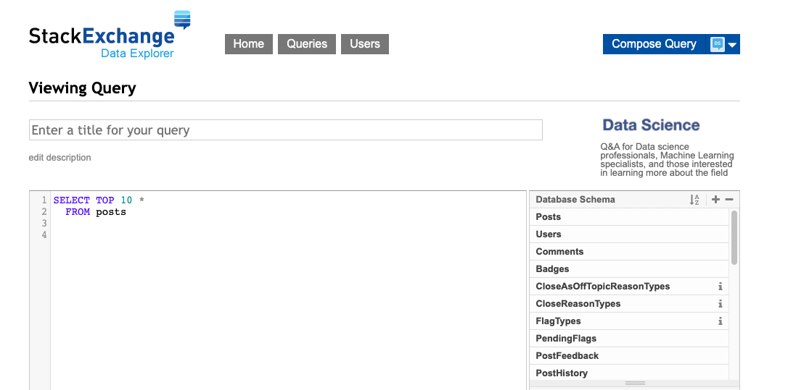
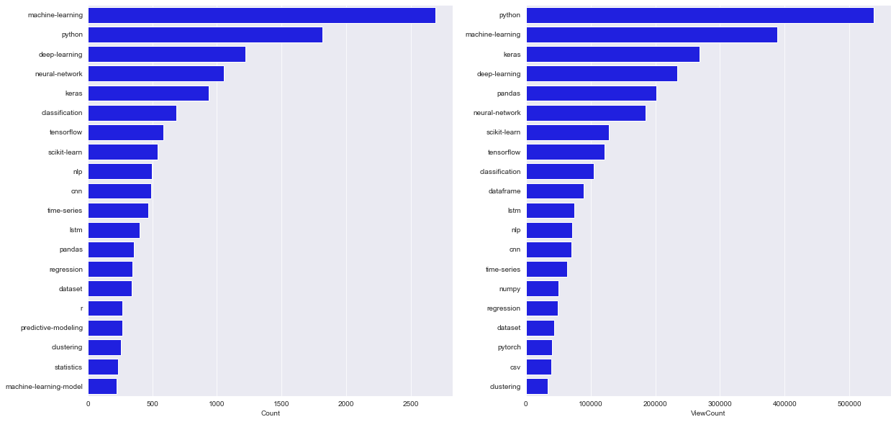

# Answering Business Question - Popular Data Science Subject

Recommend what content should a Data Science education company create based on interest.  

## Introduction
A hypothetical data science education company is interested in creating content in terms of blog posts, lessons, videos etc. We have been tasked to figure out what is the best content to write about. We as data scientists have decided to model 'best content' based on what are people most interested in learning about (as opposed to what would be the most profitable content)

To find the *most talked* about or *interesting* subject, we decided to get information from the Data Science Stack Exchange [(DSSE)](https://datascience.stackexchange.com/) website which is a subset of the [Stack Exchange network](https://stackexchange.com/). Stack Exchange is a popular website for programmers to ask questions and get answers.

## Installation

To copy the project, simply clone the repository to your local computer, unzip and run the following from the command line:
```
conda env create --file environment.yml
pip install -r requirement.txt
```
if you have conda or pip respectively. This will install the required depedencies to run the jupyter notebook. Finally, open jupyter notebook (`Basics.ipynb`) and run each cell. 

## Methods & Technologies
- Data Extraction    
- Data Visualization
- [Requirements](requirement.txt)

## Description

### Data


[Stack Exchange Data Explorer](https://data.stackexchange.com/datascienceme/query/new) is a database of the Stack Exchange network. It stores information about the posts created on the website, its users, etc. This data can be accessed using [Transact-SQL](https://tableplus.com/blog/2018/11/sqlite-vs-sql-server.html). T-SQL is similar to SQLite except it uses a slightly different dialect. After browsing through the database, we ran the following query and downloaded the required data in `2019_questions.csv`. 

```
SELECT Id, CreationDate,
       Score, ViewCount, Tags,
       AnswerCount, FavoriteCount
  FROM posts
 WHERE PostTypeId = 1 AND YEAR(CreationDate) = 2019
 ORDER BY CreationDate
```

We focused our search on the most recent posts (2019 at the time of writing this project which is early 2020). `PostTypeId=1` limits our search to only question and answer posts. The downloaded data contains more than 8830 entries and 7 columns. Below is a preview of the data


|  Id          |CreationDate         |Score      | ViewCount |      Tags                           | AnswerCount  |  FavoriteCount|
|--------------|---------------------|-----------|------|---------------------------------------------------|---------------|-----|
| 44419        | 2019-01-23 09\:12\:13    | 1         | 21   | \<machine-learning\>\<data-mining\>                   | 0             | NaN |
| 44420        | 2019-01-23 09\:34\:01 | 0         | 25   | \<machine-learning\>\<regression\>\<linear-regression\> | 0             | NaN |

where - 
- *Id*: sample id
- *CreationDate*: Date the post was created (datetime format)
- *Score*:
- *ViewCount*: how many times the post was viewed
- *Tags*: post identifiers
- *AnswerCount*: how many answers or replies did the post get
- *FavoriteCount*: How many times has the post been added as a favorite by other users (here NaN would mean 0)
    
### Important points
1. cleaned and transformed the `Tags` column to count how many times each tag appears in the dataframe as well as its total number of `ViewCount`.
2. As a subject matter expert, we know that deep-learning is a broad area encompassing *nlp, cnn, tensorflow, classification, keras, neural-network* among other things. We added a new column that categorized whether the tags in each row belonged to the deep-learning category or not.
3. Grouped the data based on `CreationDate` to calculate the frequency of posts on the subject.

### Conclusions




**Deep-learning** was found to be the most viewed and most talked about subject in the field of data-science. Despite a slight downturn in latter half of 2019, there has been a linear increase in the number of questions being asked in this subject since 2015. Therefore, we recommend that the company creating content in *deep-learning using python*.

